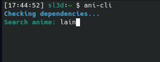
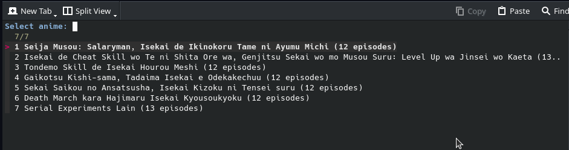
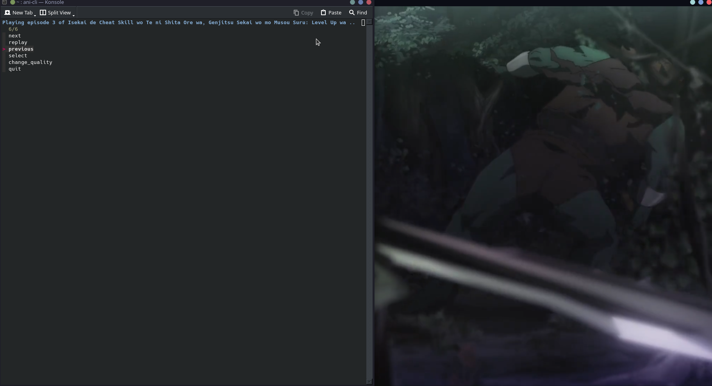

# Ani Cli для Debian based 

## Оглавление  
- [Что такое ani cli](#whatis)
- [Зависимости](#zavisimosti)
- [Установка](#download)    
    1. [APT](#apt) 
    2. [GIT](#git)  
- [Ипользование](#usecase)


### <a id="whatis"> Что такое ani cli </a>

**Ani cli** - консольная команда, которая позволяет смотреть аниме в терминале. 

### <a id="zavisimosti">Зависимости</a> 

| Утилита  | Описание                   |     |
| -------- | -------------------------- | --- |
| grep     | Поиск в файлах             |     |
| sed      | Редактирование потока      |     |
| curl     | Передача данных по URL     |     |
| mpv      | Видеоплеер                 |     |
| aria2c   | Менеджер скачивания        |     |
| yt-dlp   | Загрузчик m3u8             |     |
| ffmpeg   | Загрузчик m3u8 (резервный) |     |
| fzf      | Пользовательский интерфейс |     |
| ani-skip | Пропуск опенингов          |     |
| patch    | Самообновление             |     |
### <a id="download">Установка</a> 
1. <a id="apt">APT</a> 
```bash
sudo apt install ani-cli
```
2. <a id="git">GIT</a>
 ``` bash
git clone "https://github.com/pystardust/ani-cli.git"
sudo cp ani-cli/ani-cli /usr/local/bin
rm -rf ani-cli 
```
### <a id="usecase">Использование</a> 
1.  
2. 
3. 


